# TripLink — תרשימי UML מלאים

מסמך לספר פרויקט. כל התרשימים בפורמט Mermaid — ניתן להעתיק ל-[mermaid.live](https://mermaid.live) או לייצא כ-PNG/SVG.

---

## 0. תרשים זרימה ≠ תרשים UML — מה לשים בספר?

תרשים עם קופסות וחצים **מלמעלה למטה** (משתמש → Angular → Pipeline → שלבים → DB) הוא **תרשים ארכיטקטורה / זרימה** — שימושי להסבר, אבל **לא** תרשים UML תקני.

| מה יש בתרשים הידני | למה זה לא UML | מה להשתמש במקום |
|---------------------|---------------|------------------|
| קופסות ללא סוג (class/interface/component) | UML דורש סוג ישות ויחסים מוגדרים | **Class** או **Component** Diagram |
| כל השלבים «יוצאים» מה-Pipeline במקביל | Pipeline רץ **בסדר** 0→2→4→5→6 | **Sequence** Diagram או Component עם תלות מסודרת |
| לולאה אדומה על Step4/Step5 | לא סימון UML סטנדרטי | ב-Sequence: `loop` / `alt`; ב-Activity: צומת |
| חצים דו-כיווניים בכל מקום | Sequence = הודעות בזמן, לא קשר קבוע | חץ אחד = קריאה; חץ חוזר = תשובה |

**לסעיף 7 בספר — מומלץ:**

1. **תרשים רצף (Sequence)** — סעיף 7.2 (התרשים התקני לזרימת אופטימיזציה).
2. **תרשים רכיבים (Component)** — סעיף 7.1 (מבנה שכבות + DB/API).
3. **לא** להעתיק תרשים זרימה כללי כ«תרשים UML».

---

## 1. תרשים ארכיטקטורה (Component Diagram)

שכבות המערכת ותלויות חיצוניות.

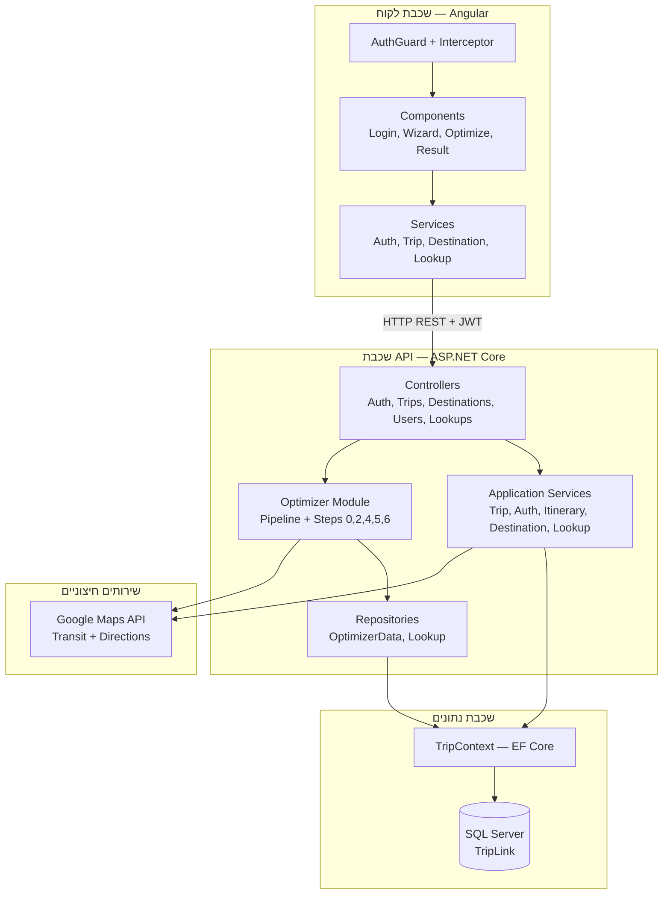

---

## 2. תרשים פריסה (Deployment Diagram)

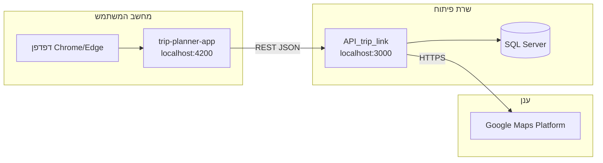

---

## 3. תרשים ישויות — מסד נתונים (ER Diagram)

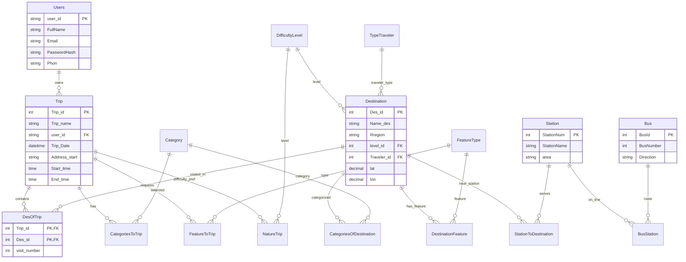

---

## 4. תרשים מחלקות — Controllers ו-Services (Backend)

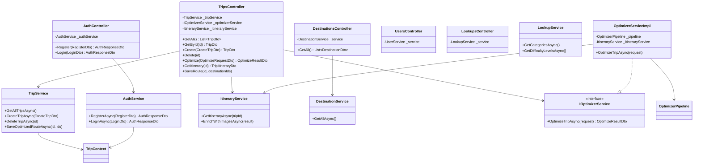

---

## 5. תרשים מחלקות — מודול האופטימייזר

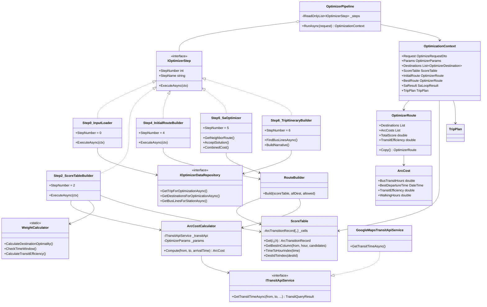

---

## 6. תרשים מחלקות — Frontend Angular

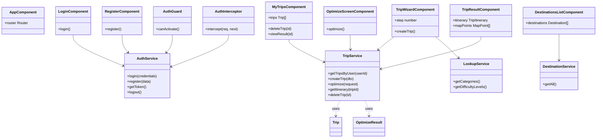

---

## 7. אופטימיזציה — תרשימי UML לסעיף בספר

### 7.1 תרשים רכיבים (Component Diagram) — מבנה, לא זמן

תרשים UML תקני ל**מי מדבר עם מי** (לא סדר הרצה). מתאים להחליף תרשים הזרימה הידני.

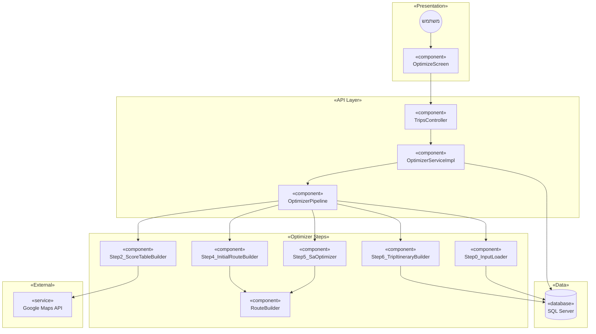

**סדר הרצה בפועל** (לא מופיע בתרשים רכיבים — רק בתרשים רצף):  
`S0 → S2 → S4 → S5 → S6`

---

### 7.2 תרשים רצף (Sequence Diagram) — **מתוקן לקוד (Steps 0→2→4→5→6)**

תרשים UML תקני, מותאם ל-`Program.cs` ול-Pipeline הנוכחי.  
**העתיקי את הבלוק למטה** ל-[mermaid.live](https://mermaid.live) לייצוא PNG.

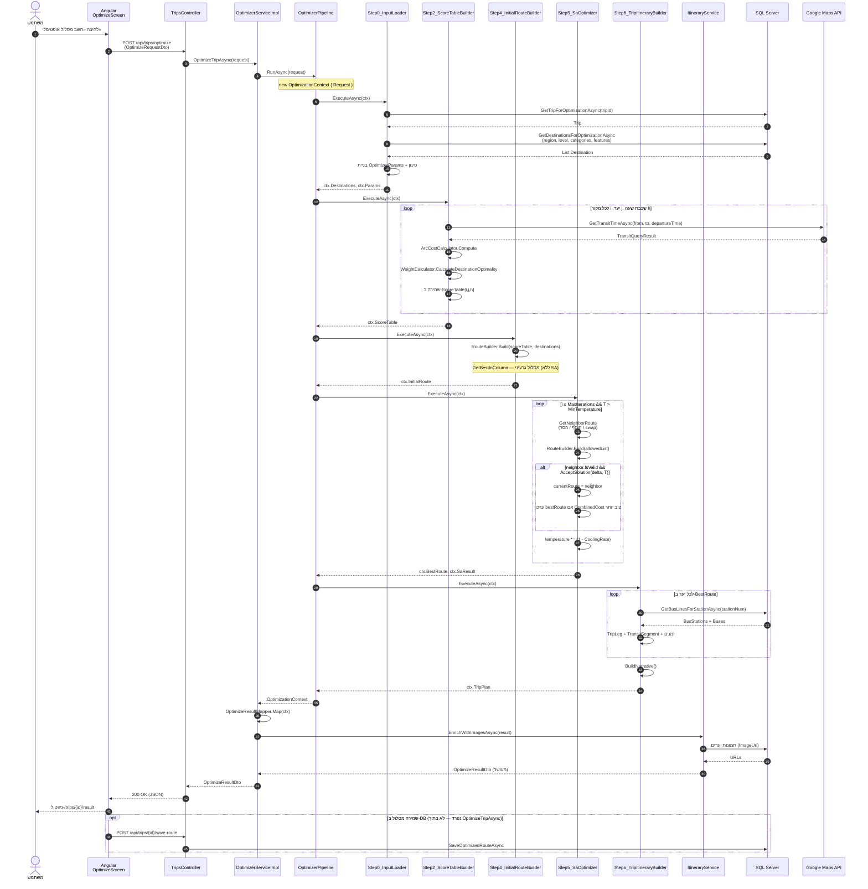

**מה הוסר מהתבנית הישנה (לא בקוד):** Step3_TravelTimeBuilder, Step4_TripOptimizer, Step5_TripSummaryBuilder, GetDistMatrixAsync, SaveResultToDbAsync בתוך אופטימיזציה.

---

### 7.3 תרשים רצף מקוצר (לספר — קל לציור ב-Word / draw.io)

פחות participants — מתאים לעמוד אחד בספר.

```mermaid
sequenceDiagram
    actor U as משתמש
    participant FE as Angular
    participant API as TripsController
    participant Opt as OptimizerService
    participant DB as SQL Server
    participant GM as Google Maps

    U->>FE: חשב מסלול
    FE->>API: POST /optimize
    API->>Opt: OptimizeTripAsync()

    Opt->>DB: Step0: טיול + יעדים מסוננים
    DB-->>Opt: Destinations

    loop Step2: בניית טבלה
        Opt->>GM: זמני נסיעה
        GM-->>Opt: TransitResult
    end

    Opt->>Opt: Step4: מסלול גרעיני

    loop Step5: SA
        Opt->>Opt: שכן + Accept/Reject
    end

    Opt->>DB: Step6: קווי אוטובוס
    DB-->>Opt: BusLines

    Opt-->>API: OptimizeResultDto
    API-->>FE: JSON
    FE-->>U: מסך תוצאות
```

---

## 8. תרשים רצף — זרימת משתמש (Use Case Flow)

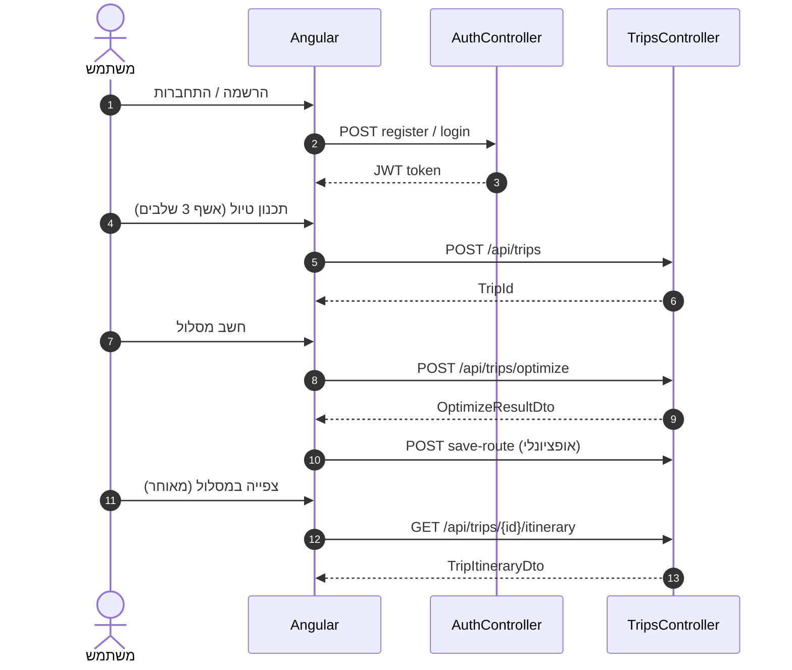

---

## 9. תרשים פעילות — Pipeline האופטימייזר (Activity Diagram)

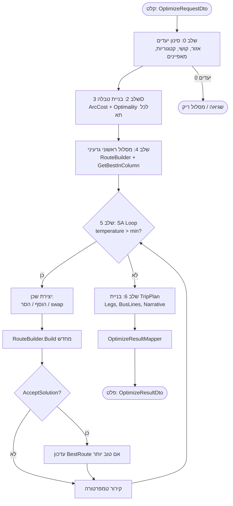

---

## 10. תרשים מקרי שימוש (Use Case Diagram)

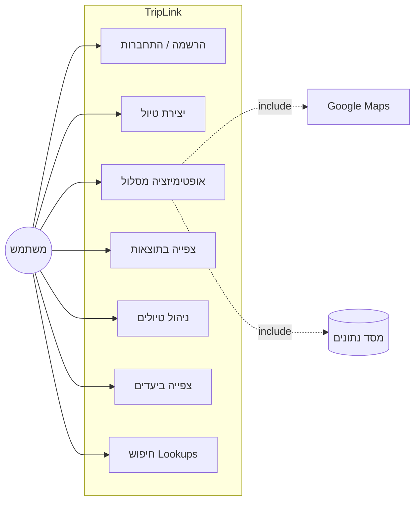

---

## 11. מפת נתיבים — Frontend Routes

| נתיב | Component | Auth |
|------|-----------|------|
| `/login` | LoginComponent | — |
| `/register` | RegisterComponent | — |
| `/my-trips` | MyTripsComponent | ✓ |
| `/plan` | TripWizardComponent | ✓ |
| `/plan/optimize/:tripId` | OptimizeScreenComponent | ✓ |
| `/trips/:id/result` | TripResultComponent | ✓ |
| `/destinations` | DestinationsListComponent | ✓ |

---

## 12. מפת API Endpoints

| Method | Endpoint | Controller |
|--------|----------|------------|
| POST | `/api/auth/register` | AuthController |
| POST | `/api/auth/login` | AuthController |
| GET | `/api/trips` | TripsController |
| GET | `/api/trips/{id}` | TripsController |
| GET | `/api/trips/user/{userId}` | TripsController |
| POST | `/api/trips` | TripsController |
| DELETE | `/api/trips/{id}` | TripsController |
| POST | `/api/trips/optimize` | TripsController |
| GET | `/api/trips/{id}/itinerary` | TripsController |
| POST | `/api/trips/{id}/save-route` | TripsController |
| GET | `/api/destinations` | DestinationsController |
| GET | `/api/users` | UsersController |
| GET | `/api/lookups/*` | LookupsController |

---

*גרסה 1.0 — מעודכן ל-Pipeline: Step 0 → 2 → 4 → 5 → 6*
